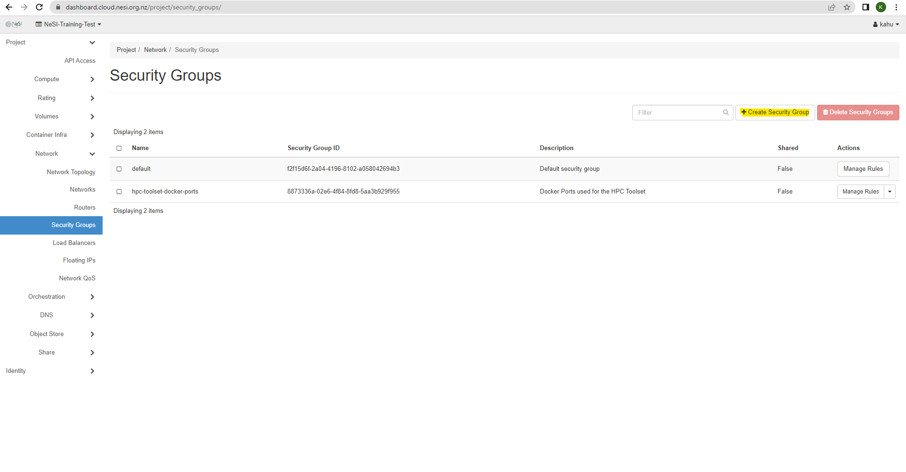
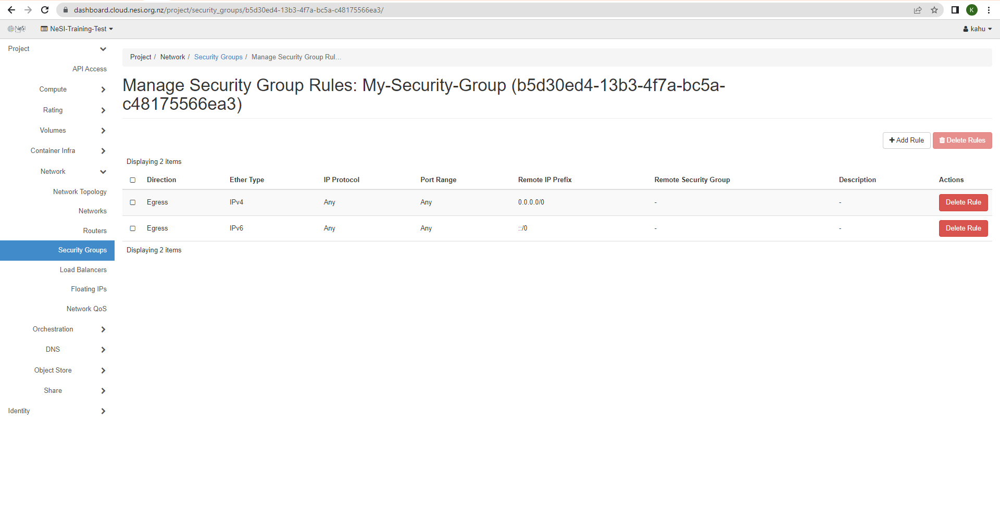
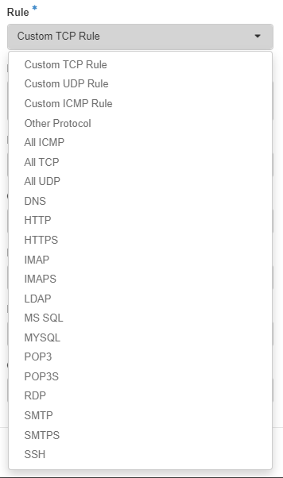
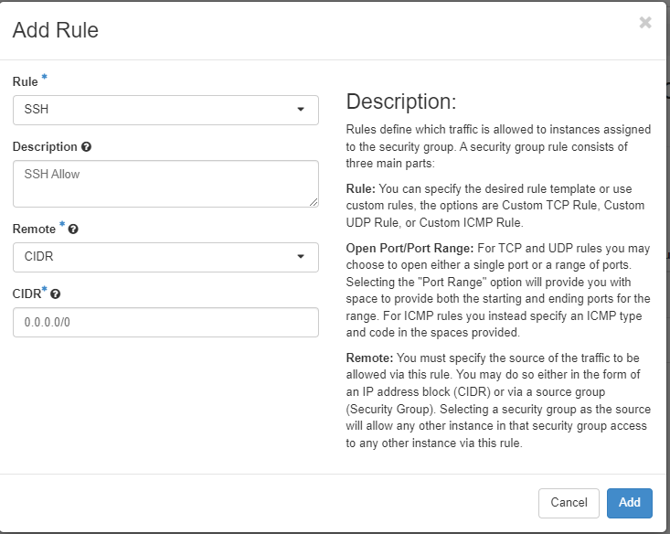
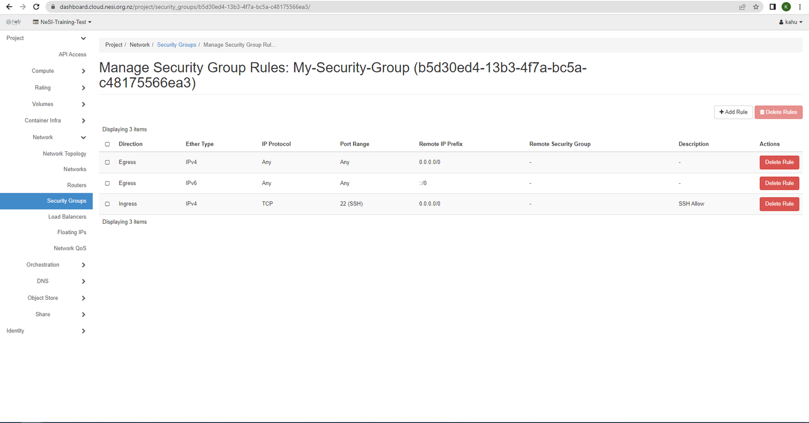
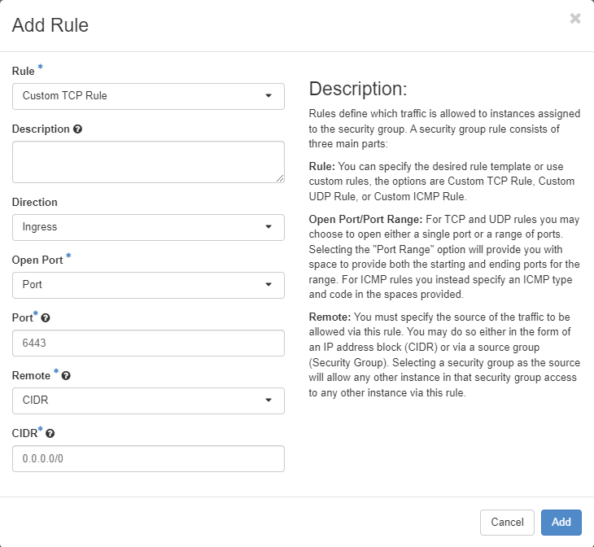
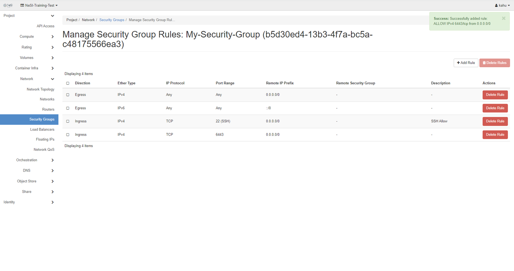

## The Default secuirty group

Log into the [NeSI FlexiHPC Dashboard](https://dashboard.cloud.nesi.org.nz/)

Select the project you would like to deploy the new instance too (Use the project selector on the top left-hand side):

<figure markdown>
  
</figure>

Open the `Project` tab, open the `Network` tab and select the `Security Groups` category

!!! note
    We recommend that no new rules are added to the `deafult` security group to keep things clean and tidy. We also recommend that no rules be removed from this group.

<figure markdown>
  
</figure>

There are 2 Egress and 2 Ingress rules, each one is associated with either IPv4 or IPv6.

The 2 Egress rules allow the resources within the FlexiHPC project to communicate with the outside world.

The 2 Ingress rules allow any other resource within the FlexiHPC project that has this security group associated to it is allowed to communicate with each other.

## Creating a new Security Group

First start by clicking on `Create Security Group`

<figure markdown>
  
</figure>

Within the `Create Security Group` dialog you have the following options.

`Name`
:   A friendly name for your network, this field is requried.

`Description`
:   A friendly description to identify what this is used for

Once those have been filled out hit the `Create Security Group` button and that will take you to the newly created security group

<figure markdown>
  
</figure>

## Updating a Security Groups Rules

We have a few ways of adding new rules to the security groups, either with predefined rules or customs rules.

### Using Predefined Rules

Find the security group that you would like to update the rules for and click `Manage Rules` under the `Action` column

<figure markdown>
  
</figure>

Once in the security group we want to click on `Add Rule` on the top right

<figure markdown>
  
</figure>

We are presented with the following dialog that allows us to add new rules based on the direction(Ingress/Egress) that we want to apply the rule. Think of these as Firewall Rules

<figure markdown>
  
</figure>

There are all ready a few predefined rules that are ready to use if you so chose

<figure markdown>
  
</figure>

For this example we will create an `SSH` rule

<figure markdown>
  
</figure>

We have specified the `SSH` Rule, given it a description so it explains what it is for other users, we have chosen `CIDR` as the remote and left the `CIDR` as `Allow All`.

!!! info
    If we changed that CIDR to 192.168.0.0/16 then only machines that reside within that IP Range will be able to pass through this Rule.

    For the above example we want to be able to SSH to a Compute Service within the FlexiHPC space however the IP that we would be connecting from would be our Public IP, therefore using the above CIDR would actually block our attempts to SSH to the compute service that has this rule applied.

    If you wish to restrict the Rule to only your Public IP then google whats my ip and use the IP that is provided prefixed with /32

Clicking `Add` will update the Security group with the newly created rule

<figure markdown>
  
</figure>

### Using Custom Rules

Find the security group that you would like to update the rules for and click `Manage Rules` under the `Action` column

<figure markdown>
  
</figure>

Once in the security group we want to click on `Add Rule` on the top right

<figure markdown>
  
</figure>

We are presented with the following dialog that allows us to add new rules based on the direction(Ingress/Egress) that we want to apply the rule. Think of these as Firewall Rules

<figure markdown>
  
</figure>

For this Example rule we will allow port `6443`.

So the things we need to ensure are Rule has been set to `Custom TCP Rule`, The Direction is `Ingress` as we are allowing the port into the FlexiHPC space and the Port we would like to allow, in this case `6443`.

We will also leave Remote as `CIDR` and the `CIDR` as allow all, as denoted by `0.0.0.0/0`

<figure markdown>
  
</figure>

We click `Add` and our rule is now added to the security group

<figure markdown>
  
</figure>
