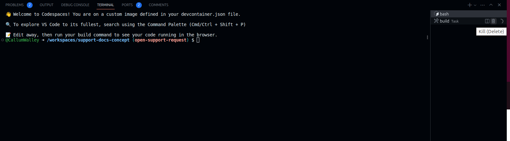

# Customising Theme

## Previewing

If theme files have been modified, you will need to rebuild and restart the docs server. (The 'rebuild on changes' does not cover template files).

### Restarting server (codespaces)

In the 'terminal' tab, kill the 'build' task by clicking the rubbish bin.



Then start the build again by pressing <kbd>Ctrl</kbd> + <kbd>Shift</kbd> + <kbd>B</kbd>.

You will see the 'build' task reappear.

## Overrides

This is for customising the [material theme](https://squidfunk.github.io/mkdocs-material/customization/).

When possible, it is best to _extend_ a template (using 'super') rather than straight replacing.

Overriding files must mirror the original file structure if you are replacing an existing file.
However, you can put your own custom stuff in here.
Here is a list of the original available files, before override:

You can find the original files in the [mkdocs-material repo](https://github.com/squidfunk/mkdocs-material/tree/master/src/templates).

```tree
├─ .icons/                             # Bundled icon sets
├─ assets/
│  ├─ images/                          # Images and icons
│  ├─ javascripts/                     # JavaScript files
│  └─ stylesheets/                     # Style sheets
├─ partials/
│  ├─ integrations/                    # Third-party integrations
│  │  ├─ analytics/                    # Analytics integrations
│  │  └─ analytics.html                # Analytics setup
│  ├─ languages/                       # Translation languages
│  ├─ actions.html                     # Actions
│  ├─ alternate.html                   # Site language selector
│  ├─ comments.html                    # Comment system (empty by default)
│  ├─ consent.html                     # Consent
│  ├─ content.html                     # Page content
│  ├─ copyright.html                   # Copyright and theme information
│  ├─ feedback.html                    # Was this page helpful?
│  ├─ footer.html                      # Footer bar
│  ├─ header.html                      # Header bar
│  ├─ icons.html                       # Custom icons
│  ├─ language.html                    # Translation setup
│  ├─ logo.html                        # Logo in header and sidebar
│  ├─ nav.html                         # Main navigation
│  ├─ nav-item.html                    # Main navigation item
│  ├─ pagination.html                  # Pagination (used for blog)
│  ├─ palette.html                     # Color palette toggle
│  ├─ post.html                        # Blog post excerpt
│  ├─ progress.html                    # Progress indicator
│  ├─ search.html                      # Search interface
│  ├─ social.html                      # Social links
│  ├─ source.html                      # Repository information
│  ├─ source-file.html                 # Source file information
│  ├─ tabs.html                        # Tabs navigation
│  ├─ tabs-item.html                   # Tabs navigation item
│  ├─ tags.html                        # Tags
│  ├─ toc.html                         # Table of contents
│  ├─ toc-item.html                    # Table of contents item
│  └─ top.html                         # Back-to-top button
├─ 404.html                            # 404 error page
├─ base.html                           # Base template
├─ blog.html                           # Blog index page
├─ blog-archive.html                   # Blog archive index page
├─ blog-category.html                  # Blog category index page
├─ blog-post.html                      # Blog post page
└─ main.html                           # Default page
```

The following files have been overridden/added.

`supported_apps.html`: Added. Custom template for supported apps page. Should only be used there.
`main.html`: OVERRIDDEN. Needed to include custom banner, [concept_banner.html](partials/concept_banner.html).
